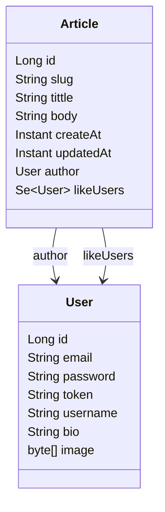

## Все способы частичной загрузки JPA сущностей в Spring приложении

### Содержание

- [О проекте](#о-проекте)
- [Задача](#задача)
- [Тестовые данные](#тестовые-данные)
- [Тестирование](#тестирование)
    - [Basic attributes](#basic-attributes)
    - ToOne
        1. Repository derived methods. Interface-based flat projections
        2. Repository derived methods. Interface-based nested projections
        3. Repository derived methods. Class-based flat projections
        4. Repository derived methods. Class-based nested dto projections
        5. Repository derived methods. Class-based nested entity projections
        6. Repository query methods. Interface-based flat projections
        7. Repository query methods. Interface-based nested projections
        8. Repository query methods. Class-based flat projections
        9. Repository query methods. Class-based nested projections
        10. Repository query methods. Object Array
        11. Repository query methods. Tuple
        12. Repository query methods. Map (select new map)
        13. Repository query methods. List (select new list)
        14. Repository query methods. Custom mapper
        15. Entity Manager. Object Array
        16. Entity Manager. Tuple
        17. Entity Manager. Class-based Projections (select new)
        18. Entity Manager. Map (select new map)
        19. Entity Manager. List (select new list)
        20. Criteria API. Object Array
        21. Criteria API. Tuple
        22. Criteria API. Class-based Projections (select new)
        23. Criteria API. Map (select new map)
        24. Criteria API. List (select new list)
    - ToMany
        1. Repository derived methods. Interface-based nested projections
        2. Repository derived methods. Class-based nested dto projections
        3. Repository derived methods. Class-based nested entity projections
        4. Repository query methods. Interface-based nested projections
        5. Repository query methods. Class-based nested projections
        6. Repository query methods. Object Array
        7. Repository query methods. Tuple
        8. Repository query methods. Map (select new map)
        9. Repository query methods. List (select new list)
        10. Repository query methods. Custom mapper
        11. Entity Manager. Object Array
        12. Entity Manager. Tuple
        13. Entity Manager. Class-based Projections (select new)
        14. Entity Manager. Map (select new map)
        15. Entity Manager. List (select new list)
        16. Criteria API. Object Array
        17. Criteria API. Tuple
        18. Criteria API. Class-based Projections (select new)
        19. Criteria API. Map (select new map)
        20. Criteria API. List (select new list)
- [Выводы](#выводы)
- [Getting Started](#getting-started)
- [Built With](#built-with)
- [TODO](#todo)

### О проекте

JPA часто предъявляют за невозможность загружать сущности частично, что на самом деле является большим заблуждением.
Spring Data JPA & Hibernate включают в себя множество инструментов по частичной загрузке сущностей. В рамках доклада
рассмотрим имеющиеся в Spring Data JPA инструменты, разберем их особенности и посмотрим на corner case.
Давайте попробуем рассмотреть все способы такой частичной загрузки сущностей. Рассмотрим на примере основых способов
взаимодействия с Hibernate в Spring приложениях:

- Spring Data JPA
- EntityManager
- Criteria API

Существует еще проект [Jakarta Data](https://github.com/jakartaee/data), который активно развивается. Пока вышла только
первая стабильная версия 1.0.0 и мы не будем его рассматривать в данном эксперименте.

### Задача

В данном проекте будет рассматриваться следующая модель данных:



Наша задача для каждого способа частичной загрузки попробовать загрузить следующие данные:

1. Несколько базовый полей из сущности Author - id, slug, tittle.
2. Несколько базовый полей + ToOne ассоциация. В нашем случае это author: User - id, username
3. Несколько базовый полей + ToMany ассоциация. Для likeUsers также будем загружать id, username.

Запрос буде простой - найти все статьи заголовок которых содержит заданный текст. Поиск не чувствительный к регистру,
т.е. contains with ignore case.

Проверять результат мы будем в соответствующих тестах, результат запроса будут видны в консоли. Специальный анализ
логов, который бы показывал что выбираются только те поля что мы хотим, я не писал. Просто смотрю в логи, какой sql
генерирует hibernate

### Тестовые данные

Создадим две записи Article c двумя подписчиками.

### Тестирование

Под derived method будем понимать, запросы которые основаны на имени метода, т.е. без явного указания аннотации @Query.
В данном случае, у нас есть всего один способ как мы можем указать какие атрибуты мы хотим загрузить,
это [projection](https://docs.spring.io/spring-data/jpa/reference/repositories/projections.html). Но проекции бывают
двух видов, основанные на интерфейсах (Interface-based Projections) и на классах (Class-based Projections). Еще есть,
так
называемые [Open Projections](https://docs.spring.io/spring-data/jpa/reference/repositories/projections.html#projections.interfaces.open),
где значение гетеров интерфейсов могу высчитываться на основе SpEL выражения:

```java
interface NamesOnly {
    @Value("#{target.firstname + ' ' + target.lastname}")
    String getFullName();
}
```

Их мы рассматривать не будет, т.к. в документации явно сказанно, что для них оптимизация запроса производиться не будет.
Это действительно так, я проверил.
> Spring Data cannot apply query execution optimizations in this case, because the SpEL expression could use any
> attribute of the aggregate root.

Также, для загрузки ToOne ассоциаций мы хотим проверить два варианта с flatten(плоскими) атрибутами и с nested(
вложенным) классом. Для ToMany будем проверять только nested, flat не работает ни в каком виде. На практике flat для
ToMany, мог бы быть полезен при загрузке коллекции одного атрибута, например id, но это ни как не поддерживается в
проекциях.

#### Basic attributes
Всего я нашел 18 способов частичной загрузки для кейса когда нам надо загрузить только basic attributes.
Эти способы включают в себя разные подходы написания запроса:
- Repository derived methods
- Repository query methods
- Entity Manager
- Criteria API

Тестовый класс в котором можно увидеть все тесты с комментариями - [BasicAttributesTest](/src/test/java/io/amplicode/jpa/repository/BasicAttributesTest.java).
Поскольку проект находится в стадии разработки, могут дополняться или убираться методы, но в конечном варианте должны соответствовать следующему списку:
1. Repository derived methods. Interface-based projections
2. Repository derived methods. Class-based projections
3. Repository query methods. Interface-based projections
4. Repository query methods. Class-based projections
5. Repository query methods. Object Array
6. Repository query methods. Tuple
7. Repository query methods. Map (select new map)
8. Repository query methods. List (select new list)
9. Entity Manager. Object Array
10. Entity Manager. Tuple
11. Entity Manager. Class-based Projections (select new)
12. Entity Manager. Map (select new map)
13. Entity Manager. List (select new list)
14. Criteria API. Object Array
15. Criteria API. Tuple
16. Criteria API. Class-based Projections (with select new)
17. Criteria API. Class-based Projections (without select new)
18. Criteria API. List

### Выводы
1. Выводы делайте сами
2. Open source есть open source
3. Если мы пишем HQL/JPQL query, то мы контролируем запрос и возвращаем только то что мы хотим. 
Вопрос только в том как мапить.
4. Если мы пишем HQL/JPQL всегда можно вернуть tuple и помапить с него на dto
5. Использовать ли repository derived method, мне кажется нет, но решайте сами. В простых случаях и HQL будет простым, 
в сложных длина имени метода будет стремиться выйти за приделы нашей солнечной системы.
6. Когда мы работаем с Tuple очень удобно подключить библиотеку hibernate-jpamodelgen и использовать автогенеренные константы.
В последней документации hibernate данный способ используется во всех примерах, можно сказать, что это тихая рекомендация.


### Built With

- Spring Boot
- Java 21
- Spring Data JPA
- Hibernate
- H2
- PostgreSQL
- Junit

### Getting Started

1. Clone project
2. Go to project directory
3. Run project tests

```shell
./gradlew test
```

### TODO
- Надо ли рассматривать Embedded?
- Надо ли рассматривать JPA Specification и его проблемы?
- Надо ли рассматривать Pagination?
- Кастом мапинг, кажется вообще не работает. Надо ли об этом говорить?
org.springframework.core.convert.ConverterNotFoundException: No converter found capable of converting from type [org.springframework.data.jpa.repository.query.AbstractJpaQuery$TupleConverter$TupleBackedMap] to type [io.amplicode.jpa.projection.PostBasicDto]
В классе org.springframework.data.repository.query.ResultProcessor.ProjectingConverter в котором и происходит конвертация resultType
есть ConversionService, но всегда инициализируется как DefaultConversionService.getSharedInstance() и его не очень то и пополнишь(