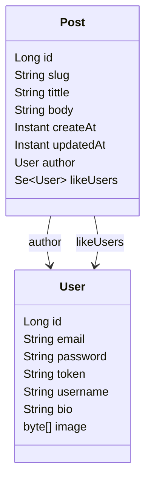

## JPA Entity. Загрузи меня не полностью!


### Содержание

- [О проекте](#о-проекте)
- [Интересует ли эта проблема сообщество](#интересует-ли-эта-проблема-сообщество)
- [Задача](#задача)
- [Тестовые данные](#тестовые-данные)
- [Тестирование](#тестирование)
    - [Basic attributes](#basic-attributes)
    - [ToOne](#to-one)
    - [ToMany](#to-many)
- [Выводы](#выводы)
- [Getting Started](#getting-started)
- [Built With](#built-with)
- [TODO](#todo)

### О проекте

JPA часто предъявляют за невозможность загружать сущности частично, что на самом деле является большим заблуждением.
Spring Data JPA & Hibernate включают в себя множество инструментов по частичной загрузке сущностей. В рамках исследования
рассмотрим имеющиеся в Spring Data JPA инструменты, разберем их особенности и посмотрим на corner case.
Давайте попробуем рассмотреть все способы такой частичной загрузки сущностей. Рассмотрим на примере основых способов
взаимодействия с Hibernate в Spring приложениях:

- Spring Data JPA
- EntityManager
- Criteria API

Существует еще проект [Jakarta Data](https://github.com/jakartaee/data), который активно развивается. Пока вышла только
первая стабильная версия 1.0.0 и мы не будем его рассматривать в данном эксперименте.

### Интересует ли эта проблема сообщество
О да, еще как интересует! Для этого отправимся в путешествие на stackoverflow. Напишем в поиске тег [spring-data-jpa] и
отсортируем по популярности вопросы. Мы увидим, что вопрос [Spring JPA selecting specific columns](https://stackoverflow.com/questions/22007341/spring-jpa-selecting-specific-columns)
находится на шестом месте.
И в этом проекте мы постараемся ответить на этот вопрос максимально полно. Наш обзор будет касаться не только загрузки
базовых атрибутов, но мы также окунемся в мир ассоциаций JPA.

### Задача

В данном проекте будет рассматриваться следующая модель данных:



Наша задача для каждого способа частичной загрузки попробовать загрузить следующие данные:

1. Несколько базовый полей из сущности Author - id, slug, tittle.
2. Несколько базовый полей + ToOne ассоциация. В нашем случае это author: User - id, username
3. Несколько базовый полей + ToMany ассоциация. Для likeUsers также будем загружать id, username.

Запрос буде простой - найти все статьи заголовок которых содержит заданный текст. Поиск не чувствительный к регистру,
т.е. contains with ignore case.

Проверять результат мы будем в соответствующих тестах, результат запроса будут видны в консоли. Специальный анализ
логов, который бы показывал что выбираются только те поля что мы хотим, я не писал. Просто смотрю в логи, какой sql
генерирует hibernate.

### Тестовые данные

Создадим две записи Post c двумя подписчиками и автором. Сервис в котором создаются и удаляются данные [InitTestDataService](/src/test/java/io/amplicode/jpa/InitTestDataService.java)

### Тестирование

Под derived method будем понимать, запросы которые основаны на имени метода, т.е. без явного указания аннотации @Query.
В данном случае, у нас есть всего один способ как мы можем указать какие атрибуты мы хотим загрузить,
это [projection](https://docs.spring.io/spring-data/jpa/reference/repositories/projections.html). Но проекции бывают
двух видов, основанные на интерфейсах (Interface-based Projections) и на классах (Class-based Projections DTOs). Еще есть,
так
называемые [Open Projections](https://docs.spring.io/spring-data/jpa/reference/repositories/projections.html#projections.interfaces.open),
где значение гетеров интерфейсов могу высчитываться на основе SpEL выражения:

```java
interface NamesOnly {
    @Value("#{target.firstname + ' ' + target.lastname}")
    String getFullName();
}
```

Их мы рассматривать не будет, т.к. в документации явно сказано, что для них оптимизация запроса производиться не будет.
Это действительно так, я проверил.
> Spring Data cannot apply query execution optimizations in this case, because the SpEL expression could use any
> attribute of the aggregate root.

Также, для загрузки ToOne ассоциаций мы хотим проверить два варианта с flatten(плоскими) атрибутами и с nested(
вложенным) классом. Для ToMany все устроенно чуть сложнее, там также может быть кейс с nested и flat, но сам hibernate не умеет мапить вложенные коллекции, он вернет плоские записи и нам самостоятельно придется их помапить.

Важно, в тестах будут приведены только рабочие варианты, т.е. те которые успешно справляются с поставленной задачей, т.е. частичной загрузкой.
Примеры в которых можно загрузить данные, но они выгружают больше данных чем нужно, рассматриваться не будут.

#### Basic attributes
Всего я нашел 17 способов частичной загрузки для кейса когда нам надо загрузить только basic attributes.
Эти способы включают в себя разные подходы написания запроса:

- Repository derived methods
- Repository query methods
- Entity Manager
- Criteria API

Тестовый класс в котором можно увидеть все тесты с
комментариями - [BasicAttributesTest](/src/test/java/io/amplicode/jpa/repository/BasicAttributesTest.java).
Поскольку проект находится в стадии разработки, могут дополняться или убираться методы, но в конечном варианте должны
соответствовать следующему списку:

1. Repository derived methods. Interface-based projections
2. Repository derived methods. Class-based projections
3. Repository query methods. Interface-based projections
4. Repository query methods. Class-based projections
5. Repository query methods. Object Array
6. Repository query methods. Tuple
7. Repository query methods. Map (select new map)
8. Repository query methods. List (select new list)
9. Entity Manager. Object Array
10. Entity Manager. Tuple
11. Entity Manager. Class-based Projections (select new)
12. Entity Manager. Map (select new map)
13. Entity Manager. List (select new list)
14. Criteria API. Object Array
15. Criteria API. Tuple
16. Criteria API. Class-based Projections
17. Criteria API. List

#### To one
Тестовый класс в котором можно увидеть все тесты с
комментариями - [ToOneTest](/src/test/java/io/amplicode/jpa/repository/ToOneTest.java).

Рассматриваются следующие кейсы:

1. Repository derived methods. Interface-based flat projections
2. Repository derived methods. Interface-based nested projections. Это как раз тот случай когда запрос выполняется, но работает не правильно, т.е. загружает больше полей чем надо. 
3. Repository derived methods. Class-based flat projections
4. Repository query methods. Interface-based flat projections
5. Repository query methods. Interface-based with nested dto class projections.
6. Repository query methods. Class-based flat projections
7. Repository query methods. Class-based nested class projections
8. Repository query methods. Class-based nested map projections
9. Repository query methods. Tuple
10. Repository query methods. Map (select new map)
11. Repository query methods. Object Array
12. Repository query methods. List (select new list)
13. Entity Manager. Class-based Projections (select new)
14. Entity Manager. Tuple
15. Entity Manager. Map (select new map)
16. Entity Manager. Object Array
17. Entity Manager. List (select new list)
18. Criteria API. Tuple
19. Criteria API. Class-based Projections
20. Criteria API. Object Array
21. Criteria API. List (list)

#### To many

Тестовый класс в котором можно увидеть все тесты с
комментариями - [ToManyTest](/src/test/java/io/amplicode/jpa/repository/ToManyTest.java).

Рассматриваются следующие кейсы:

1. Repository derived methods. Interface-based projections
2. Repository derived methods. Class-based projections
3. Repository query methods. Interface-based nested projections
4. Repository query methods. Class-based flat projections
5. Repository query methods. Class-based nested projections
6. Repository query methods. Object Array
7. Repository query methods. Tuple
8. Repository query methods. Map (select new map)
9. Repository query methods. List (select new list)
10. Entity Manager. Class-based Projections (select new)
11. Entity Manager. Tuple
12. Entity Manager. Map (select new map)
13. Entity Manager. Object Array
14. Entity Manager. List (select new list)
15. Criteria API. Tuple
16. Criteria API. Object Array
17. Criteria API. Class-based Projections
18. Criteria API. List (select new list)

### Выводы

1. Если мы пишем HQL/JPQL query, то мы контролируем запрос и возвращаем только то что мы хотим. Вопрос только в том как мапить.
2. Если мы пишем HQL/JPQL всегда можно вернуть tuple или Map и помапить с него на dto.
3. Использовать ли repository derived method, решает каждый сам. В простых случаях и HQL будет простым,
   в сложных длинна имени метода будет стремиться выйти за приделы нашей солнечной системы. В рамках решаемых задач для этого проекта, конкретно частичная выгрузка данных, repository derived method выглядит самым не безопасным. Мы не контролируем запрос, HQL может поменяться из-за изменения DTO/Projection или самой Entity.
4. Когда мы работаем с Tuple очень удобно подключить библиотеку hibernate-jpamodelgen и использовать автогенеренные
   константы. В последней документации hibernate данный способ используется во всех примерах, можно сказать, что это тихая
   рекомендация. Также, используя эти константы легко создавать jakarta.persistence.criteria.Path для Criteria API.
5. Когда мы пишем Query в spring data и используем DTO, по дефолту будут валидироваться выражение с DTO,
   будут проверены как типы, так и количество аргументов в конструкторе. А самое главное ни какой прокси магии.
6. Не знаете что вернуть, верните Tuple. Это очень удобно. 
7. HQL + Class-Based Projection, он же DTO, он же select new class конструкция работают всегда. 
8. Для ToMany, при выгрузки данных в виде Projection/DTO/Tuple нам придется решать вопрос о мердже дублирующихся данных.  

### Built With

- Spring Boot
- Java 21
- Spring Data JPA
- Hibernate
- H2
- PostgreSQL
- Junit

### Getting Started

1. Clone project
2. Go to project directory
3. Run project tests

```shell
./gradlew test
```

### TODO
- Надо ли рассматривать Embedded?
- Надо ли рассматривать JPA Specification и его проблемы?
- Надо ли рассматривать Pagination?
- Кастом мапинг, кажется вообще не работает. Надо ли об этом говорить?
  org.springframework.core.convert.ConverterNotFoundException: No converter found capable of converting from
  type [org.springframework.data.jpa.repository.query.AbstractJpaQuery$TupleConverter$TupleBackedMap] to
  type [io.amplicode.jpa.projection.PostBasicDto]
  В классе org.springframework.data.repository.query.ResultProcessor.ProjectingConverter в котором и происходит
  конвертация resultType
  есть ConversionService, но всегда инициализируется как DefaultConversionService.getSharedInstance() и его не очень то
  и пополнишь(
- Как правильно называется способ писать запрос на основе имени метода - "Repository derived methods"? 